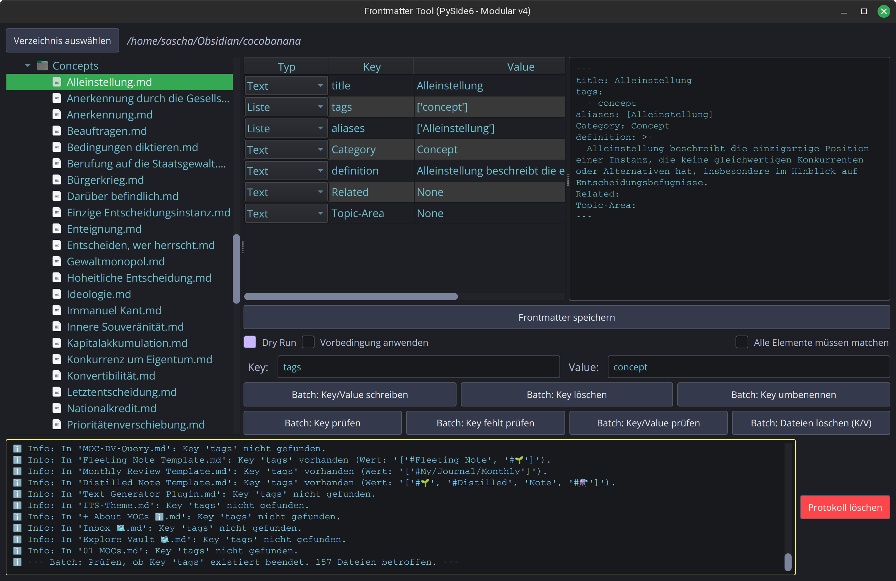

# Obsidian Frontmatter Tool

Ein leistungsstarkes, modulares Desktop-Tool (PySide6) zur komfortablen Bearbeitung, Analyse und Batch-Verwaltung von YAML-Frontmatter in Markdown-Dateien – inspiriert von Obsidian, aber unabhängig nutzbar.



## Features

- **Datei-Explorer** mit Kontextmenü für Einzeldatei-Aktionen (Key/Value schreiben, Key löschen, Key umbenennen, Datei löschen)
- **Editierbarer Frontmatter-Viewer** (List-View):
  - Typauswahl pro Key (Text, Liste, Zahl, Checkbox, Datum)
  - Änderungen direkt speichern
  - Automatische Typ-Erkennung und -Konvertierung
  - Geteilte Ansicht: Tabelle (editierbar) & YAML-Ansicht (readonly)
- **Batch-Aktionen** für viele Dateien:
  - Key/Value schreiben, Key löschen, Key umbenennen
  - Key/Value prüfen, Dateien nach Kriterium löschen
  - Flexible Vorbedingungen (inkl. value_matches-Logik)
  - Dry-Run-Modus für gefahrlose Tests
- **Protokollbereich** mit farbiger, formatierter Log-Ausgabe (inkl. Emojis)
- **Cyberpunk-Theme** (dunkel, modern, anpassbar)
- **Robuste Fehlerbehandlung** (YAML, Dateioperationen)
- **Modularer, testbarer Code** (Unit-Tests für Kernfunktionen)

## Installation

1. **Python 3.12+** installieren
2. Repository klonen:

   ```zsh
   git clone <repo-url>
   cd frontmatter_tool_project
   ```

3. Abhängigkeiten installieren (empfohlen: venv):

   ```zsh
   python -m venv .venv
   source .venv/bin/activate
   pip install -r requirements.txt
   # oder mit Poetry:
   poetry install
   ```

## Starten

```zsh
python main.py
```

## Tests ausführen

```zsh
pytest tests/
```

## Projektstruktur (Auszug)

```text
main.py
app/
  main_window.py         # Hauptfenster & UI-Logik
  core/
    actions/            # Batch- und Einzelaktionen (modular)
    utils.py            # value_matches etc.
  ui_components/        # Dialoge, Table-Viewer, Explorer
  styles/               # Cyberpunk-Theme
TODO.md                 # Aufgaben & Milestones
```

## Hinweise

- Das Tool arbeitet direkt auf Markdown-Dateien mit YAML-Frontmatter (z.B. aus Obsidian).
- Listen, Zahlen, Checkboxen und Datumswerte werden automatisch erkannt und korrekt gespeichert.
- Die Log-Ausgabe ist farbig und hebt Fehler, Warnungen, Infos und Erfolge visuell hervor.
- Komfortfunktionen wie Zeile hinzufügen/löschen, Validierung etc. sind in Planung (siehe TODO.md).

## Lizenz

MIT

---

**Entwickelt mit ❤️ für die Obsidian- und Markdown-Community.**
