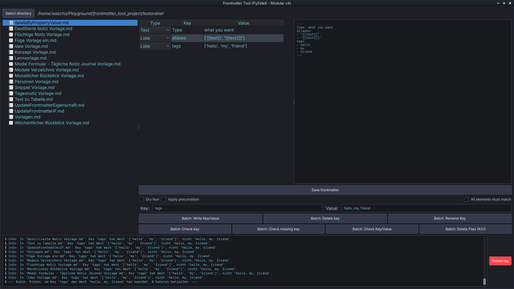

# Obsidian Frontmatter Tool

A powerful, modular desktop tool (PySide6) for convenient editing, analysis and batch management of YAML frontmatter in Markdown files - inspired by Obsidian, but can be used independently.



*Translations: [Deutsch](README_de.md) | [Français](README_fr.md)*

## Features

* **File explorer** with context menu for individual file actions (write key/value, delete key, rename key, delete file)
* **Editable frontmatter viewer** (list view):
  * Type selection per key (text, list, number, checkbox, date)
  * Save changes directly
  * Automatic type detection and conversion
  * Split view: Table (editable) & YAML view (read-only)
* **Batch actions** for many files:
  * Write key/value, delete key, rename key
  * Check key/value, delete files according to criteria
  * Flexible preconditions (incl. value\_matches logic)
  * Dry-run mode for safe testing
* **Log area** with colored, formatted log output (incl. emojis)
* **Cyberpunk theme** (dark, modern, customizable)
* **Robust error handling** (YAML, file operations)
* **Modular, testable code** (unit tests for core functions)

## Installation

1. **Install Python 3.12+**

2. Clone repository:

    ```zsh
    git clone <repo-url>
    cd frontmatter_tool_project
    ```

3. Install dependencies (recommended: venv):

    ```zsh
    python -m venv .venv
    source .venv/bin/activate
    pip install -r requirements.txt
    # oder mit Poetry:
    poetry install
    ```

## Start

```zsh
python main.py
```

## Language selection

The user interface language is set to French by default.

You can change the language at any time while the program is running via the **Language** menu (at the top menu bar), switching between French, English and German.

Manual editing of the `main.py` file is no longer necessary.

If you cloned the project, generate the French translation by running:

```zsh
pyside6-lrelease translations/fr.ts -qm translations/fr.qm
```

## Execute tests

```zsh
pytest tests/
```

## Project structure (excerpt)

```text
main.py
app/
  main_window.py         # Hauptfenster & UI-Logik
  core/
    actions/            # Batch- und Einzelaktionen (modular)
    utils.py            # value_matches etc.
  ui_components/        # Dialoge, Table-Viewer, Explorer
  styles/               # Cyberpunk-Theme
TODO.md                 # Aufgaben & Milestones
```

## Notes

* The tool works directly on Markdown files with YAML frontmatter (e.g. from Obsidian).
* Lists, numbers, checkboxes and date values are automatically recognized and saved correctly.
* The log output is in color and visually highlights errors, warnings, information and successes.
* Comfort functions such as add/delete line, validation etc. are being planned (see TODO.md).

## License

MIT

* * *

**Developed with ❤️ for the Obsidian and Markdown community.**
